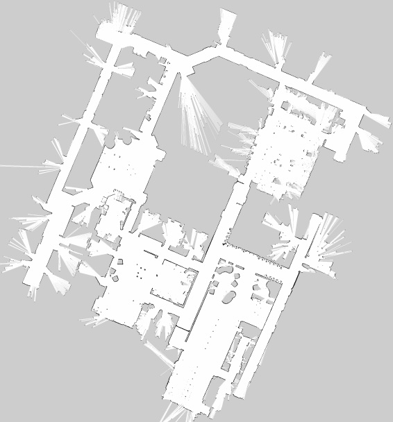

# OccupancyGrids.jl

A Julia package for working with occupancy grids.

## Installation

```julia
using Pkg
Pkg.add("OccupancyGrids")
```

## Usage

This package provides a set of tools for working with occupancy grids. The core type is `OccupancyGrid`, which can be instantiated as a `DenseOccupancyGrid`.

### Loading a Map

The main way to interact with this package is to load a grid from a file. Currently, only grids that are included with the package are supported.

```julia
using OccupancyGrids

# Load the Willow Garage map
grid = load_grid(WillowGarage) # WillowGarage is an enum of tyope IncludedMaps
```

You can also pass keyword arguments to `load_grid` to modify the grid upon loading:

- `inflation`: (Float64) The inflation radius in meters. Obstacles will be inflated by this amount. Defaults to `0.0`.
- `negate`: (Bool) If `true`, the input `data` is negated (i.e., `1.0 - data`). This is useful when the input data has `1` for free and `0` for occupied. Defaults to `false`.

Example:
```julia
# Load the Willow Garage map with a 0.5 meter inflation radius
grid = load_grid(WillowGarage, inflation=0.5)
```

### Checking for Occupancy

Once you have a grid, you can check if a particular location is occupied:

```julia
is_occupied(grid, 0.5, 1.2)  # Returns true or false
is_occupied(grid, (0.5, 1.2))
is_occuped(grid, [0.5, 1.2])
```

### Signed Distance Fields

You can also compute the Signed Distance Field (SDF) for any point in the grid. The SDF returns 0 if the location is occupied, and for free space, it returns the distance to the nearest obstacle.

```julia
sdf(grid, 0.5, 1.2)  # Returns the distance to the nearest obstacle
sdf(grid, (0.5, 1.2))
sdf(grid, [0.5, 1.2])
```

## Supported Maps

### Willow Garage



### Simple Indoor

A simple indoor environment.


### Simple Indoor 1


### Simple Indoor 2

A second simple indoor environment.


## Creating a Compatible Map w/Illustrator

1. Create a desired map
2. Export As a PNG file, using a white background & high PPI settings
3. Using Imagemagick, run:
```bash
magick output_file.png output_file.pgm
```

## Adding an Environment to the Package
1. Create the folder in the maps/ directory
2. Add an enum entry in 'src/load_grid.jl'
3. Add a dict entry in 'src/load_grid.jl'
4. Export the enum from LoadGrid and OccupancyGrid modules
